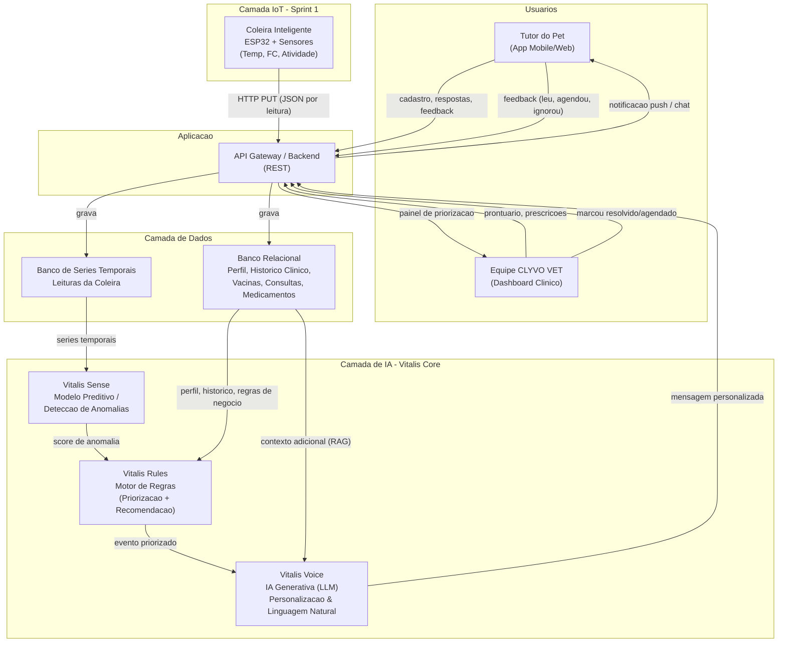

# PetCare 360 — Componente de Inteligência Artificial
[]()
[]()
[]()
[](https://github.com/PetCare-360/Sprint1-IOT)
### Sprint 2 | Disruptive Architectures: IoT, IoB & Generative AI
Cliente: **CLYVO VET**

> Este repositório é a continuação da [**Sprint 1 (IoT)**](https://github.com/PetCare-360/Sprint1-IOT), na qual construímos a PoC da coleira inteligente (ESP32 + sensores simulados no Wokwi) que coleta temperatura, frequência cardíaca, nível de atividade e bateria do pet e os envia para um servidor local. Nesta Sprint, definimos e documentamos **o componente de Inteligência Artificial** que transforma esses dados brutos em cuidado contínuo, personalizado e proativo para o tutor e para a clínica **CLYVO VET**.
>
> Vídeo pitch (~5 min):

##  Mapeamento com os critérios de avaliação

| Critério do enunciado | Onde está neste documento |
|---|---|
| Problema de negócio | [1. Problema de Negócio](#1-problema-de-negócio) |
| Personalização, priorização, recomendação, apoio à decisão | [3. Como a IA Agrega Valor](#3-como-a-ia-agrega-valor) |
| Fluxo de dados (usuários, app, banco, IA) | [5. Fluxo de Dados](#5-fluxo-de-dados) |
| Dados necessários (origem, estrutura, uso) | [6. Dados Necessários](#6-dados-necessários) |
| Abordagem de IA escolhida e justificativa | [4. Abordagem de IA Escolhida](#4-abordagem-de-ia-escolhida-e-justificativa) |
| Diagrama arquitetural | [7. Arquitetura de Integração](#7-arquitetura-de-integração) |
| Vídeo pitch | [`Pitch.md`](./Pitch.md) |

---

## 1. Problema de Negócio

A jornada de cuidado de um pet hoje é **fragmentada e reativa**: o tutor só descobre que algo está errado quando os sintomas já são visíveis, e a clínica só entra em ação quando o tutor liga ou aparece para uma consulta. No intervalo entre duas visitas, que pode durar meses, ninguém está olhando para o pet.

Isso gera três dores concretas que a IA da PetCare 360 precisa resolver:

- **Para o tutor:** dificuldade em interpretar sinais sutis (queda de apetite, mudança de temperatura, alteração de frequência cardíaca) antes que se tornem um problema sério, e falta de orientação personalizada sobre o que fazer com esses dados.
- **Para a clínica:** impossibilidade de monitorar proativamente uma base grande de pacientes com a equipe disponível — a triagem é manual e só acontece quando o tutor já entrou em contato, ou seja, tarde demais para ser preventiva.
- **Para o pet:** o problema real. Diagnósticos tardios, vacinas/retornos esquecidos e tratamentos com baixa adesão (dose perdida, remédio interrompido) reduzem a qualidade e a expectativa de vida.

Problema:** **Como usar os dados contínuos gerados pela coleira IoT e pelo histórico clínico do pet para antecipar problemas de saúde, priorizar quem precisa de atenção agora, e comunicar isso de forma personalizada e acionável, tanto para o tutor quanto para a equipe da CLYVO VET, sem substituir o julgamento do médico veterinário?


## 2. Objetivo da IA na Solução

A IA não existe para "ser IA", ela existe para fechar o vão entre consultas, transformando a jornada de cuidado de **reativa** em **contínua e proativa**. Os quatro objetivos específicos pedidos no enunciado se traduzem assim na nossa solução:

| Objetivo específico | Como a IA entrega isso |
|---|---|
| Personalização | Baseline individual por pet (não um valor genérico de "frequência cardíaca normal") + linguagem adaptada ao perfil do tutor |
| Priorização de ações | Score de prioridade que ordena, em tempo real, quais pets/tutores precisam de atenção primeiro |
| Recomendação de serviços | Motor de regras + histórico sugerem check-up, vacina, banho terapêutico, plano de emagrecimento, etc. |
| Apoio à tomada de decisão | Resumo pré-consulta gerado por IA para o veterinário, e orientação de próximo passo para o tutor |

---

## 3. Como a IA Agrega Valor

### 3.1 Personalização
Um Golden Retriever adulto e um Chihuahua filhote têm frequências cardíacas "normais" completamente diferentes. Em vez de aplicar um limiar fixo (ex.: "alertar se FC > 120"), o sistema constrói um **baseline individual** por pet, a partir do próprio histórico de leituras da coleira combinado com raça, idade, peso e condições pré-existentes. Só assim um desvio é, de fato, um desvio *daquele* pet — e não ruído estatístico.

### 3.2 Priorização de ações
Com dezenas (ou centenas) de pets monitorados simultaneamente, a clínica precisa saber **por onde começar**. A IA calcula um `scorePrioridade` (0–100) combinando severidade da anomalia, fatores de risco (raça/idade), tempo desde a última consulta e adesão a tratamentos — ver fórmula na [seção 7.3](#73-motor-de-regras--priorização-vitalis-rules). Isso vira uma fila de atenção ordenada no painel da clínica, e um nível de urgência (informativo / atenção / urgente) na notificação do tutor.

### 3.3 Recomendação de serviços
Cruzando dados estruturados (datas de vacina, última limpeza dentária, tendência de peso) com os eventos detectados, o sistema recomenda proativamente serviços da CLYVO VET — ex.: *"Rex está há 13 meses sem limpeza dentária e a raça tem predisposição a tártaro — sugerir agendamento."* Isso é uma lógica de recomendação (filtragem baseada em conteúdo/regras), não um chute genérico.

### 3.4 Apoio à tomada de decisão
Antes de cada consulta, o veterinário recebe um **resumo gerado por IA** consolidando: tendência dos sinais vitais desde a última visita, eventos relevantes, adesão à medicação e observações do tutor — em vez de abrir 6 telas de prontuário. Para o tutor, a IA nunca "diagnostica"; ela orienta o próximo passo (observar em casa / agendar consulta / procurar atendimento com urgência) e sempre reforça que a palavra final é do veterinário.

---

## 4. Abordagem de IA Escolhida e Justificativa

O enunciado lista seis abordagens possíveis (IA Generativa, LLM, sistema de recomendação, motor de regras inteligentes, NLP, modelo preditivo). Em vez de escolher uma única, o problema real da CLYVO VET **precisa de mais de uma**, porque cada parte dos dados exige um tipo diferente de raciocínio:

| Abordagem | Adequada para... | Usamos para... |
|---|---|---|
| **Modelo preditivo** | Séries temporais numéricas (temperatura, FC, atividade) | Detectar desvios do baseline do pet (`Vitalis Sense`) |
| **Motor de regras inteligente** | Decisões auditáveis e explicáveis sobre dados estruturados | Calcular prioridade e disparar recomendações (`Vitalis Rules`) |
| **IA Generativa / LLM** | Transformar dados estruturados em linguagem natural personalizada | Gerar mensagens para o tutor e resumos para o veterinário (`Vitalis Voice`) |
| **NLP** | Processar texto livre | Extrair informação estruturada de anotações do veterinário e de mensagens do tutor no app |
| **Sistema de recomendação** | Sugerir itens relevantes a partir de perfil + histórico | Camada de recomendação de serviços dentro do `Vitalis Rules` |

**Por que não usar só um LLM para tudo?** Pedir a um modelo generativo que "decida" se uma frequência cardíaca de 132 bpm é anormal, sem um cálculo estatístico por trás, é caro, não determinístico e difícil de auditar — inaceitável quando a saída pode gerar uma notificação de urgência para um tutor. Por isso a detecção usa um modelo estatístico/preditivo simples e explicável, e a geração de linguagem (onde o LLM é insuperável) só entra **depois** que o número já virou um evento estruturado.

**Por que não usar só regras, sem LLM?** Porque regras produzem saídas engessadas ("ALERTA: FC_ALTA") — ótimo para máquina, péssimo para um tutor ansioso às 22h. A IA generativa transforma esse evento em uma mensagem clara, empática e no tom certo, além de permitir personalização de escala (cada mensagem é gerada sob medida, sem precisar escrever um template para cada combinação possível de evento × perfil de tutor).

Chamamos essa arquitetura em camadas de **Vitalis Core**, dividida em três módulos — detalhados na seção 7.

---

## 5. Fluxo de Dados

Fluxo ponta a ponta, desde a coleta até a ação do usuário:

1. A **coleira IoT** (Sprint 1: ESP32 + sensores) envia uma leitura via `HTTP PUT` para o backend a cada intervalo configurado.
2. O **backend/API** grava a leitura no **banco de séries temporais** e, em paralelo, mantém o **banco relacional** com dados cadastrais (perfil do pet, histórico clínico, vacinas, consultas, medicamentos), atualizados pelo tutor via app e pela clínica via sistema interno.
3. O **Vitalis Sense** consome as séries temporais, compara com o baseline do pet e gera um score de anomalia quando há desvio relevante.
4. O **Vitalis Rules** recebe esse score, cruza com os dados estruturados do banco relacional (idade, raça, últimas visitas, adesão a tratamento) e calcula o `scorePrioridade`, decidindo também se há uma recomendação de serviço a disparar.
5. O **Vitalis Voice** (LLM) recebe o evento priorizado + o contexto do pet (RAG sobre o histórico) e gera: (a) uma mensagem personalizada para o tutor, e (b) um resumo técnico para a equipe clínica.
6. A **API** entrega a mensagem do tutor via notificação push/chat no app, e o resumo da clínica no painel de priorização.
7. As **ações do usuário** (tutor leu, agendou, ignorou / clínica marcou como resolvido, agendou retorno) retornam ao banco de dados, fechando o loop e alimentando o refinamento contínuo do baseline e das regras.

> O diagrama completo desse fluxo está na [seção 7.1](#71-diagrama-arquitetural).

---

## 6. Dados Necessários

| Dado | Origem | Estrutura | Uso pela IA |
|---|---|---|---|
| Perfil do pet (nome, espécie, raça, idade, peso, sexo, castrado) | Cadastro no app (tutor) | JSON estruturado | Define o baseline personalizado e o peso de risco por raça/idade |
| Histórico clínico (diagnósticos, cirurgias, alergias, condições crônicas) | Prontuário da CLYVO VET | Registros estruturados + texto livre do veterinário | Contextualiza recomendações e evita sugestões contraindicadas |
| Vacinas (tipo, data de aplicação, próxima dose) | Sistema da clínica / app | Registros estruturados | Dispara lembretes e agendamento proativo |
| Consultas (datas, motivo, exames, prescrições) | Sistema da clínica | Registros estruturados + anexos | Base do resumo pré-consulta e do histórico evolutivo |
| Medicamentos (nome, dosagem, frequência, duração) | Prescrição no app/clínica | Registros estruturados | Verifica adesão ao tratamento e alerta doses perdidas |
| Sinais vitais em tempo real (temperatura, FC, nível de atividade, bateria) | Coleira IoT (Sprint 1) | Série temporal (JSON via streaming) | Alimenta o modelo preditivo de anomalias |
| Comportamento/hábitos (sono, apetite, atividade histórica) | Sensores IoT + formulário do tutor no app | Série temporal + formulário | Refina o baseline comportamental e detecta mudanças sutis |
| Interações do tutor com o app (aberturas, respostas a notificações) | Telemetria da aplicação | Logs de eventos | Ajusta tom/frequência de comunicação e mede eficácia |
| Preferências do tutor (idioma, horário de contato) | Cadastro no app | JSON estruturado | Personaliza linguagem e timing das mensagens geradas |

**Exemplo de estrutura — leitura da coleira (evolução do `db.json` da Sprint 1):**
```json
{
  "deviceId": "COLLAR_001",
  "petId": "PET_00123",
  "timestamp": "2026-08-20T14:32:10Z",
  "temperature": 38.9,
  "heartRate": 132,
  "activityLevel": 42,
  "battery": 91
}
```

**Exemplo de estrutura — perfil do pet:**
```json
{
  "petId": "PET_00123",
  "nome": "Thor",
  "especie": "Canino",
  "raca": "Golden Retriever",
  "dataNascimento": "2021-03-14",
  "peso_kg": 32.4,
  "sexo": "M",
  "castrado": true,
  "tutorId": "USR_00456",
  "coleiraId": "COLLAR_001"
}
```

---

## 7. Arquitetura de Integração

### 7.1 Diagrama arquitetural



*(arquivo fonte também disponível em [`docs/diagrams/arquitetura-ia.mermaid`](./docs/diagrams/arquitetura-ia.mermaid) — renderiza automaticamente no GitHub)*

### 7.2 Vitalis Sense — Camada Preditiva
- **O que faz:** monitora as séries temporais da coleira (temperatura, FC, atividade) e calcula, para cada pet, um baseline individual (média móvel + desvio padrão sobre uma janela deslizante).
- **Como decide:** calcula um `zScore` = (valor observado − baseline) / desvio padrão. Valores acima de um limiar configurável (ex.: |z| > 3) geram um evento de anomalia.
- **Por que assim:** é leve, explicável, roda perto do dado (baixa latência) e não depende de infraestrutura de LLM para uma tarefa puramente numérica.

```json
{
  "petId": "PET_00123",
  "timestamp": "2026-08-20T14:32:10Z",
  "metrica": "heartRate",
  "valorObservado": 132,
  "baselinePersonalizado": 95,
  "desvioPadrao": 8.2,
  "zScore": 4.5,
  "classificacao": "anomalia_alta"
}
```

### 7.3 Vitalis Rules — Motor de Regras / Priorização
- **O que faz:** transforma o evento de anomalia em uma decisão de negócio — prioridade, urgência e recomendação de serviço — cruzando com dados estruturados do pet.
- **Fórmula de priorização (exemplo simplificado):**

```
scorePrioridade = (0.50 × zScoreNormalizado)
                 + (0.20 × fatorRiscoRacaIdade)
                 + (0.15 × diasDesdeUltimaConsultaNormalizado)
                 + (0.15 × (1 − adesaoTratamento))

0–39   -> informativo
40–69  -> atenção
70–100 -> urgente
```

- **Por que motor de regras e não só o LLM:** decisões que geram alertas de urgência precisam ser **determinísticas e auditáveis** — a clínica precisa conseguir explicar exatamente por que um pet foi priorizado. Pesos e limiares ficam documentados e versionados, não "escondidos" dentro de um prompt.

```json
{
  "eventoId": "EVT_20260820_001",
  "petId": "PET_00123",
  "origem": "anomalia_frequencia_cardiaca",
  "scorePrioridade": 87,
  "nivel": "atencao_urgente",
  "fatoresConsiderados": [
    "zScore 4.5 (alto)",
    "raça com predisposição cardíaca",
    "última consulta há 187 dias",
    "sem vacina em atraso"
  ]
}
```

### 7.4 Vitalis Voice — IA Generativa (LLM)
- **O que faz:** recebe o evento priorizado + contexto do pet (perfil, histórico resumido) e gera duas saídas em linguagem natural: mensagem para o tutor e resumo técnico para a clínica.
- **Técnica:** LLM com *prompt* estruturado e *grounding* (RAG) nos dados reais do pet — o modelo nunca "inventa" um valor, apenas explica e contextualiza os dados que o `Vitalis Rules` já validou.
- **Guardrail obrigatório:** o modelo é instruído a nunca emitir diagnóstico definitivo, apenas observações e recomendação de avaliação profissional quando aplicável.

**Exemplo de prompt de sistema:**
```
Você é o Vitalis, assistente de IA da CLYVO VET.

Contexto do pet: {perfil_json}
Evento detectado: {evento_json}
Histórico resumido: {historico_resumido}

Gere:
1. Uma mensagem curta e empática para o tutor (máx. 3 frases), em linguagem
   simples, explicando o que foi observado e a ação recomendada.
2. Um resumo técnico objetivo para a equipe clínica, com prioridade e
   justificativa (máx. 4 frases).

Regras:
- Nunca forneça diagnóstico definitivo — apenas observações e recomendação
  de avaliação profissional quando aplicável.
- Adapte o tom ao perfil de comunicação do tutor.
- Baseie-se exclusivamente nos dados fornecidos, sem inventar informações.
```

**Exemplo de saída (ilustrativa):**
> *Para o tutor:* "Oi! Notamos que a frequência cardíaca do Thor ficou acima do normal dele hoje à tarde. Pode ser só agitação momentânea, mas como ele também está há um tempo sem check-up, recomendamos agendar uma avaliação com a CLYVO VET nos próximos dias."
>
> *Para a clínica:* "Thor (Golden Retriever, 5 anos) apresentou zScore 4.5 em FC às 14h32, raça com predisposição cardíaca e 187 dias sem consulta. Prioridade: atenção urgente. Recomenda-se contato proativo para agendamento."

---

## 8. Considerações Éticas e Privacidade (LGPD)

- **Consentimento:** coleta e uso de dados do pet e de comportamento do tutor exigem consentimento explícito no cadastro do app, com opção de *opt-out* da personalização por IA.
- **Minimização e finalidade:** cada dado listado na seção 6 é coletado apenas para as finalidades descritas — não há uso secundário sem novo consentimento.
- **Transparência:** mensagens geradas por IA são identificadas como tal para o tutor; o resumo pré-consulta indica claramente que é gerado por IA e requer validação do veterinário.
- **Humano no controle:** a IA nunca substitui o diagnóstico do médico-veterinário — atua como triagem e suporte à decisão.
- **Segurança:** dados sensíveis (histórico clínico) trafegam criptografados e ficam segregados do banco de séries temporais, com controle de acesso por perfil (tutor vs. equipe clínica).
- **Viés:** o baseline por pet reduz o risco de o modelo penalizar raças menos representadas na base de treinamento (evita comparação com uma "média geral" que não reflete aquele animal).

---

## 9. Métricas de Sucesso (KPIs)

| Métrica | O que mede |
|---|---|
| Precisão/recall de anomalias validadas pelo veterinário | Qualidade do `Vitalis Sense` |
| Tempo médio entre detecção e ação do tutor | Eficácia da comunicação gerada |
| Taxa de engajamento com notificações (abertura/ação) | Qualidade da personalização |
| % de agendamentos originados por recomendação proativa | Valor de negócio para a clínica |
| Redução de emergências evitáveis | Impacto direto no bem-estar do pet |
| Tempo economizado pela equipe na triagem pré-consulta | Ganho operacional da clínica |

---

## 10. Estrutura do Repositório

```
Sprint2-IA/
├── README.md                          # este documento
├── Pitch.md                           # roteiro do vídeo pitch (~5 min)
└── docs/
    └── diagrams/
        └── arquitetura-ia.mermaid     # diagrama fonte (mesmo conteúdo da seção 7.1)
```

---

## 11. Continuidade com a Sprint 1

A camada IoT já validada na [Sprint 1](https://github.com/PetCare-360/Sprint1-IOT) — coleira ESP32 enviando `deviceId`, `temperature`, `heartRate`, `activityLevel` e `battery` via HTTP PUT para o JSON Server — é exatamente a fonte de dados que alimenta o `Vitalis Sense` nesta Sprint. O `db.json` da Sprint 1 evolui, na arquitetura proposta, para um banco de séries temporais com histórico por pet (em vez de manter apenas o último estado), permitindo o cálculo de baseline descrito na seção 7.2.

---

## Autores

Organização responsável pelo projeto: **[PetCare 360](https://github.com/PetCare-360)**

Desenvolvedores: **[Artur Correia](https://github.com/artcorreia)** · **[Gabriel H.](https://github.com/gabrielhensg)** · **[José Ricardo](https://github.com/jr-iannuzzi)** · **[Rafael de Freitas](https://github.com/devfreitas)** · **[Rafael Pascotte](https://github.com/pascotterafaaa)**
